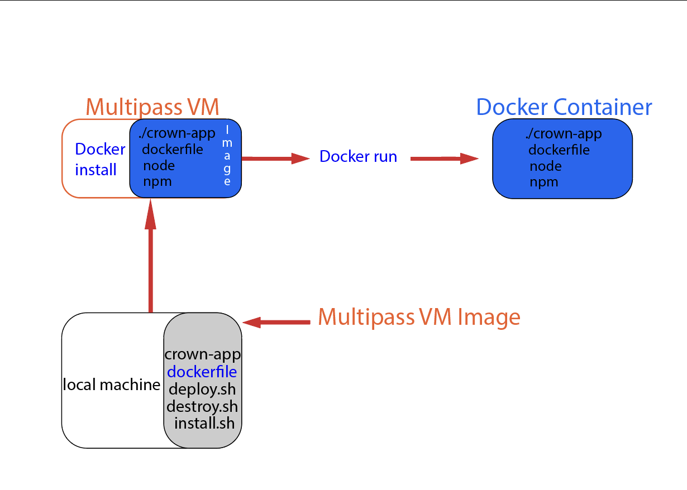

# For Mac users exclusively, after successfully cloning the application from its Github repository:

 

## Set firebase configuration
---

To replace the config variable in firebase.utils.js with your own configuration object, go to your Firebase project dashboard and select the gear icon for project settings. Scroll down to the config code section, copy the entire object and paste it in the corresponding variable in your code. This will allow you to use your own Firebase configuration in your application.

[firebase website](https://firebase.google.com/)

 

## Set stripe demo payment configuration
---

To set up the Stripe demo payment configuration in the crown-apparel directory, create a .env file and include two variables:

`REACT_APP_STRIPE_PUBLISHABLE_KEY=`

`STRIPE_SECRET_KEY=`

 

Obtain the publishable and secret keys from the developer test mode on the Stripe website and add them to the .env file in double quotes as strings, without any spaces. This will allow the application to use the Stripe test keys for demonstration purposes.

[stripe website](https://stripe.com/)

 

## To deploy the Crown App from localhost, follow these steps:
---

* Open the terminal and navigate to the crown-apparel directory.

* Open the cloud-config.yaml file and replace the hard-coded name with your own.

* In the terminal, run the command `bash vm_deploy.sh`

* When prompted, enter your computer password

* Wait for the multipass virtual machine to be created, the app to be configured, and deployed. Once completed, enter the IP address listed followed by :3000 in a browser to view the application running.

* When you are finished using the app, type "exit" into the virtual machine command prompt.

 

## To delete the virtual machine and all its contents of the Crown App from localhost:

Run the command `bash vm_destroy.sh` in your local terminal.

